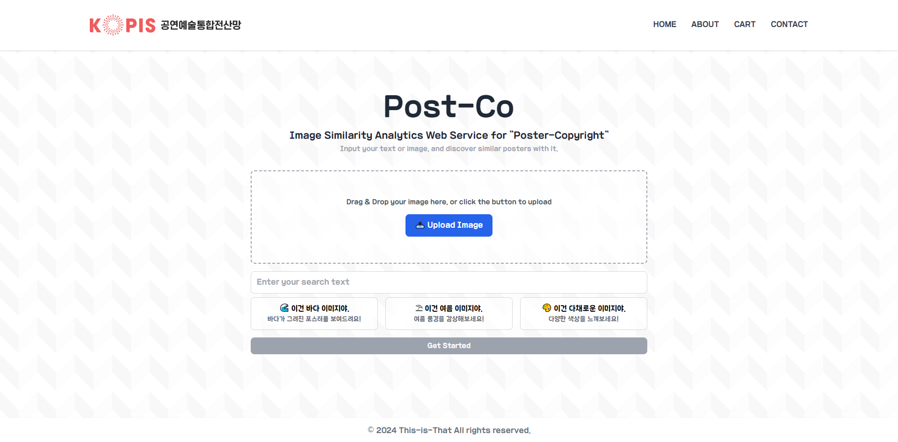

# Post-Co: Image Search & Generation Web Service for "Poster-Copyright"



<p align="center">
    
    
</p>

## 프로젝트 개요 (Project Overview)
**Post-Co**는 공연 포스터의 저작권 침해 예방과 창의적 창작을 지원하는 이미지 검색 및 생성 웹 서비스입니다. 이 웹 서비스는 사용자가 이미지 또는 텍스트를 업로드하면 관련된 포스터들을 검색할 수 있게 하며, 이를 바탕으로 새로운 이미지를 생성하거나 수정할 수 있도록 지원합니다. **Post-Co**는 창작자들이 저작권 문제를 예방하면서도 창의적인 결과물을 쉽게 만들어낼 수 있도록 설계되었습니다.

**Post-Co** is a web service designed to prevent copyright infringement in performance posters while fostering creative content creation. This service allows users to upload images or text to search for related posters and provides tools to generate or modify images based on those results. **Post-Co** is tailored to help creators avoid copyright issues while producing original and high-quality content.

## 팀 소개 (Team Information)
- **팀 이름:** 이거그건데 (This-is-That)
- **프로젝트 참여:** 2024 제 4회 KOPIS 빅데이터 공모전 - 서비스 개발 부문
- **팀원 구성:**
  - **이지환:** Client 및 Application 구현, 웹사이트 배포
  - **엄재용:** Data 수집과 전처리 및 Database 구축

- **Team Name:** This-is-That
- **Competition:** 2024 4th KOPIS Big Data Contest - Service Development Division
- **Team Members:**
  - **Jihwan Lee:** Client and Application Development
  - **Jaeyong Eom:** Data Collection and Preprocessing & Database Construction

## 주요 기능 (Key Features)
### 1. 이미지 검색 (Image Search)
- **메인 화면 (Main Interface):** 
  - 이미지 또는 텍스트를 업로드하면 입력된 정보와 유사한 공연 포스터들을 검색 결과로 제공합니다.
  - Users can upload an image or text to receive search results of posters that are similar to the input.

  
### 2. 이미지 생성 및 수정 (Image Generation and Editing)
- **장바구니 화면 (Cart Interface):** 
  - 마음에 드는 포스터를 장바구니에 담아 둘 수 있습니다.
  - 포스터와 텍스트를 활용해 새로운 이미지를 생성할 수 있으며, 생성된 이미지를 재수정할 수 있습니다.
  - Users can save their favorite posters to a cart.
  - They can generate new images using selected posters and text, and further refine the generated images.

## 사용된 기술 스택 (Tech Stack)
- **Client:** HTML, CSS, JavaScript
- **Application:** Flask, PyTorch, CLIP, OpenCV, HuggingFace (VisionGPT-2)
- **Database:** MySQL, FAISS
- **Advanced Prompt:** GPT-4o-mini
- **Translation:** NAVER PAPAGO API
- **Image Generation:** DALL-E 3
- **Cloud Database for MySQL:** NAVER CLOUD PLATFORM
- **Web Server:** Nginx
- **Web Application Deploy & Management Platform:** AWS Elastic Beanstalk

## 타 서비스와의 차별점 (Differentiators)
- **목적에 맞는 이미지 검색 (Purpose-Driven Image Search):** 
  - 기존 서비스는 특정 키워드를 포함한 이미지 검색 시 출처 확인이 어려운 결과물이 많아 활용도가 낮았습니다. 
  - **Post-Co**는 해당 키워드와 직접적으로 연관된 포스터들을 중심으로 검색 결과를 제공합니다.
  - Traditional services often return images with uncertain sources when searching for specific keywords (e.g., "winter"). 
  - **Post-Co** focuses on providing poster examples directly related to the search keyword, ensuring more relevant and usable results.
  
- **효과적인 이미지 생성 (Effective Image Generation):** 
  - 기존 서비스에서는 간단한 텍스트 입력만으로는 디테일한 이미지 생성이 어려웠으나, 
  - **Post-Co**는 프롬프트를 구체적으로 만들어 줌으로써 디테일한 이미지 생성을 돕습니다.
  - Non-designers and those unfamiliar with AI tools may find it challenging to generate detailed images using simple text input on traditional platforms.
  - **Post-Co** assists users by crafting more specific prompts based on a predefined template, enabling the creation of detailed images.

## 향후 과제 (Future Enhancements)
### 1. 프롬프트 구체화 기능 개선 (Improved Prompt Customization)
- **현재(As-Is):** AI에게 프롬프트 구체화를 의존하고 있어 사용자가 원하는 이미지를 생성하는 데 한계가 있습니다.
- **미래(To-Be):** 사용자가 직접 프롬프트를 구체화할 수 있도록 예시 키워드를 제공하여 디테일한 이미지 생성이 가능하도록 개선할 예정입니다.
- **Current (As-Is):** Users rely on AI to craft detailed prompts, which may limit the accuracy of the generated images.
- **Future (To-Be):** We plan to provide example keywords that users can utilize to fine-tune their prompts, allowing for more precise image generation.

### 2. 텍스트 렌더링 성능 개선 (Enhanced Text Rendering in Images)
- **현재(As-Is):** DALL-E 3 모델은 이미지 내 텍스트 렌더링 성능이 부족합니다.
- **미래(To-Be):** 향후 Ideogram 2.0을 사용하여 강화된 텍스트 필터링 및 색상 팔레트 기능을 제공할 계획입니다 (현재 Ideogram API는 베타 단계).
- **Current (As-Is):** The DALL-E 3 model has limitations in rendering text within images.
- **Future (To-Be):** We aim to integrate Ideogram 2.0, which will offer improved text filtering and color palette features (currently, the Ideogram API is in beta).

## 프로젝트 설치 및 실행 방법 (Installation & Setup)
1. 리포지토리를 클론합니다 (Clone the repository):
    ```bash
    git clone https://github.com/This-is-That/post-co.git
    ```
2. 필요한 패키지를 설치합니다 (Install the required packages):
    ```bash
    pip install -r requirements.txt
    ```
3. Flask 애플리케이션을 실행합니다 (Run the Flask application):
    ```bash
    python app/application.py
    ```
4. 웹 브라우저에서 `http://127.0.0.1:5000/`로 접속하여 서비스를 사용합니다.<br>
Open your web browser and go to `http://127.0.0.1:5000/` to start using the service.<br>
(단, 이미지 검색 및 생성 기능은 환경 변수 없이는 사용하실 수 없습니다.)

## 라이선스 (License)
<br>
이 프로젝트는 [MIT 라이선스](LICENSE)를 따릅니다.<br>
This project is licensed under the [MIT License](LICENSE).
